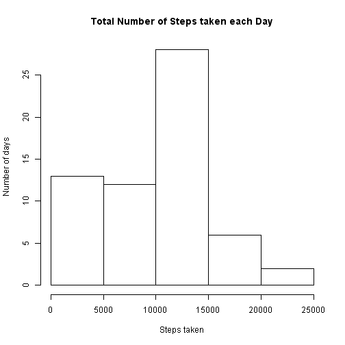

#Reproducible Research Assignment

## Loading and preprocessing the data

###Code for reading in the dataset and/or processing the data

```r
# read data
activity <- read.csv("activity.csv",header = TRUE)

# no further processing needed at this point
```

## What is mean total number of steps taken per day?
###Histogram of the total number of steps taken each day

```r
#Number of steps per day
totalPerDay <- tapply(activity$steps,activity$date, sum, na.rm = TRUE)
hist(totalPerDay, xlab = "Steps taken", ylab = "Number of days", main = "Total Number of Steps taken each Day")
```



###Mean and median number of steps taken each day

```r
#calculate mean and median, round to integer
meanSteps <- as.integer(mean(totalPerDay))
medianSteps <- as.integer(median(totalPerDay))
```
The mean number of steps taken on a day is **9354**, the median is **10395**.


## What is the average daily activity pattern?

###Time series plot of the average number of steps taken

```r
#average daily activity pattern
averagePerInterval <- tapply(activity$steps,activity$interval, function(x){mean(x, na.rm=TRUE)})
plot(averagePerInterval,type = "l", xlab = "Interval",ylab = "Average Number of Steps")
```


###The 5-minute interval that, on average, contains the maximum number of steps


```r
# compute the maximum value (and its index, name)
maxIntervalIndex <- which.max(averagePerInterval)
maxIntervalName  <- names(maxIntervalIndex) 
maxIntervalValue <- as.integer(averagePerInterval[maxIntervalIndex])

# compute time intervall where this maximum lies
timeIntervalStart<- as.POSIXlt(as.Date("2012-10-01"))
timeIntervalEnd<- as.POSIXlt(as.Date("2012-10-01"))
timeIntervalStart$min <- maxIntervalName
timeIntervalEnd$min <- as.integer(maxIntervalName) +5
```
The **104th** 5min interval on a day ( after **835** minutes) contains the maximum number of steps i.e. **206** of steps on the average.
The interval is from **13:55** to **14:00**.

## Imputing missing values

### Code to describe and show a strategy for imputing missing data


```r
numberOfNA <- sum(is.na(activity)[,"steps"])
```
The number of missing values in the data set is **2304**

The following statements replace this missing values by the average value of the 5 minute time interval generated by the existing values:


```r
# day in observation
daysobserved <- nrow(activity)/288
# vector of averages of same length as dataset with possible replacements
averages <- rep(averagePerInterval,times=daysobserved)
# index vector where replacements should happen
index <- is.na(activity)[,"steps"]
activityFilled <- activity
# replacing NAs with averages
activityFilled$steps[index] <- averages[index]
```

###Histogram of the total number of steps taken each day after missing values are imputed


```r
#Number of steps per day
totalPerDay <- tapply(activityFilled$steps,activityFilled$date, sum, na.rm = TRUE)
hist(totalPerDay, xlab = "Steps taken", ylab = "Number of days", main = "Total Number of Steps taken each Day")
```


```r
#calculate mean and median, round to integer
meanSteps <- as.integer(mean(totalPerDay))
medianSteps <- as.integer(median(totalPerDay))
```
The mean number of steps taken on a day (after replacing missing value) is **10766**, the median is **10766**. Both values are equal.
The values are higher when missing values are replaced by the above mentioned strategy.

## Are there differences in activity patterns between weekdays and weekends?

### Panel plot comparing the average number of steps taken per 5-minute interval across weekdays and weekends


```r
#create new factor variable for weekdays and weekends
Sys.setlocale("LC_TIME","English United States")
activityFilled$type <- factor(weekdays(as.Date(activityFilled$date)))
levels(activityFilled$type) <- list(weekday=c("Monday","Tuesday","Wednesday","Thursday","Friday"), weekend=c("Saturday","Sunday"))
```


```r
# combine along two factors
averagePerIntervalSeparated <- as.data.frame(tapply(activityFilled$steps,list(activityFilled$interval,activityFilled$type), mean))
averagePerIntervalSeparated$interval <- rownames(averagePerIntervalSeparated)

# melt to one column
library(reshape2)
averagePerIntervalCombined <- melt(averagePerIntervalSeparated,id=c("interval"), measure.vars = c("weekday", "weekend") )

#plot
library(lattice)
averagePerIntervalCombined$interval <- as.numeric(averagePerIntervalCombined$interval)
xyplot(averagePerIntervalCombined$value ~ averagePerIntervalCombined$interval | averagePerIntervalCombined$variable, layout = c(1, 2), type="l", xlab = "Interval", ylab="Average Steps")
```


